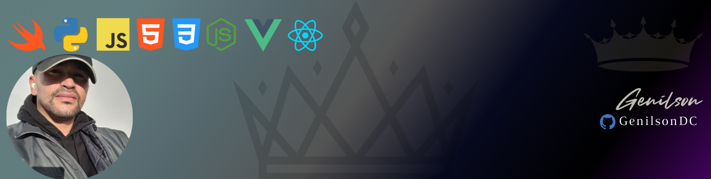
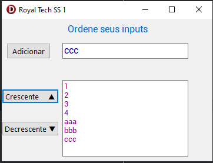
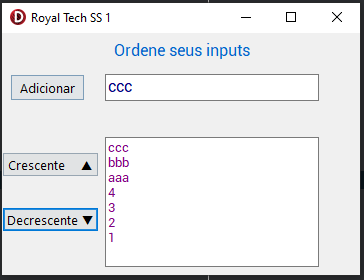

####         

###      [Wikipedia](https://en.wikipedia.org/wiki/Object_Pascal)

>  **Object Pascal** é uma ramificação de linguagens derivativas de [Pascal](https://pt.wikipedia.org/wiki/Pascal_(linguagem_de_programação)), com suporte a [orientação a objetos](https://pt.wikipedia.org/wiki/Orientação_a_objetos). As principais ferramentas para programar em Object Pascal são o [IDE](https://pt.wikipedia.org/wiki/Ambiente_de_desenvolvimento_integrado) [Embarcadero Delphi](https://pt.wikipedia.org/wiki/Embarcadero_Delphi) e o [Lazarus](https://pt.wikipedia.org/wiki/Lazarus_(ADI)). Foi usada nas sete primeiras versões do ambiente Delphi. Depois, foi substituído por uma versão também chamada de Delphi.
>
>
>  att,
>
>  **♕** **Genilson do Carmo**

####  

 

 	

 

 

              
